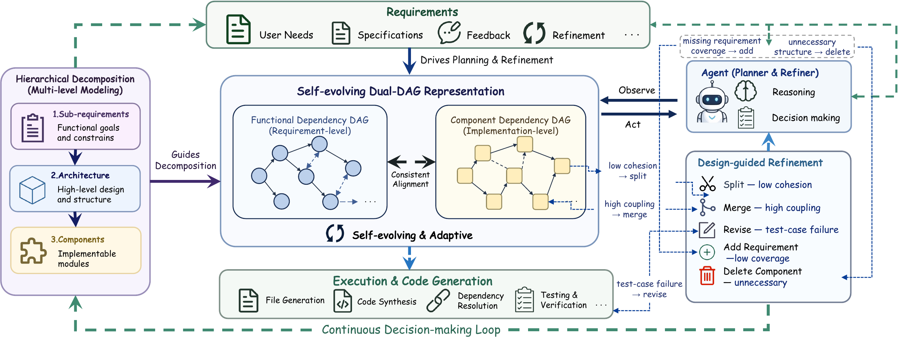

# Repo0

Repo0 is the artifact implementation for a metrics-guided framework that generates a complete code repository from high-level natural-language requirements. The system starts from a requirement document, builds requirement and component graphs, and iteratively improves the architecture with cohesion- and coupling-driven structural actions before materializing the final repository.




## 🧭 What This Artifact Contains

This repository contains the main Repo0 pipeline, prompts, agents, tests, and raw requirement inputs used to support the paper submission.

The cleaned artifact keeps the core implementation focused on the main method:

- `agents/`: requirement ingestion, architecture planning, structural refinement, merging/splitting, module planning, code generation, and repair agents.
- `scripts/`: helper scripts for artifact inspection, metric summaries, evaluation preparation, and generated-repository utilities.
- `tests/`: regression tests for key pipeline behavior.
- `repo_input/`: raw `README.req` requirement inputs used by the artifact examples.
- `run_repo0_main.sh`: the primary artifact entry point.

## 🧩 Method Pipeline

Repo0 follows the paper's zero-to-repository generation process:

1. Extract high-level requirements from `README.req` or a README-derived input.
2. Decompose requirements into sub-requirements.
3. Generate the initial component-level architecture.
4. Add missing actions when input requirements are not covered by the generated requirement graph.
5. Compute component cohesion and coupling from the requirement/component alignment.
6. Use metrics to drive structural evolution:
   - `split`: triggered by low cohesion, guided by requirement-graph partition evidence, and rewritten by the LLM into child component responsibilities.
   - `merge`: triggered by high coupling and admitted only after an LLM merge judge verifies redundant responsibility.
7. Repeat structural refinement until no split or merge is proposed.
8. Run a final boundary-preserving `revise` round.
9. Generate the complete code repository from the optimized final framework.

## ⚙️ Setup

Use Python 3.10+ and install the artifact dependencies:

```bash
python -m venv .venv
source .venv/bin/activate
pip install -r requirements.txt
```

The pipeline uses an OpenAI-compatible chat-completions endpoint. Set `API_KEY` before running:

```bash
export API_KEY="your_api_key"
```

Optional environment variables:

- `REPO_NAME`: input project name. Default: `requests`.
- `MODEL`: model name. Default: `gpt-5-mini`.
- `BASE_URL`: OpenAI-compatible API base URL.
- `MAX_WORKERS`: parallel worker count. Default: `8`.
- `OUTPUT_DIR`: output directory. Default: `outputs/${REPO_NAME}`.

## 🚀 Running Repo0

Run the main artifact pipeline:

```bash
bash run_repo0_main.sh
```

Run a specific included input:

```bash
REPO_NAME=statsmodels API_KEY="$API_KEY" bash run_repo0_main.sh
```

Included requirement-only inputs are:

- `django`
- `pandas`
- `requests`
- `scikit-learn`
- `statsmodels`
- `sympy`

Generated requirements and repository outputs are written under `outputs/<repo_name>/` unless `OUTPUT_DIR` is set.

## 📦 Expected Outputs

A successful run produces intermediate and final artifacts such as:

- extracted requirements and requirement DAGs;
- decomposed sub-requirements;
- initial and refined architecture JSON files;
- component metric reports for cohesion, coupling, split candidates, and merge candidates;
- action refinement round reports;
- gap-addition reports when missing input coverage is detected;
- generated repository files under the configured output directory.

Exact output filenames can vary by run configuration, but the main pipeline writes JSON reports alongside the generated repository so that each structural decision can be inspected.

## 🧪 Tests

Run the artifact regression tests with:

```bash
pytest tests
```

The tests focus on local logic such as graph parsing, action normalization, metric-guided refinement, code-generation utilities, import repair, and helper scripts. End-to-end generation requires a configured LLM endpoint.

## 📊 Evaluation Workflow

This cleaned artifact repository focuses on Repo0's generation pipeline. The benchmark evaluation workflow follows the RPG evaluation infrastructure.

For evaluation scripts, benchmark protocol, and score computation, please use the RPG-ZeroRepo repository:

https://github.com/microsoft/RPG-ZeroRepo

In a typical artifact workflow:

1. Run Repo0 here to generate repositories from requirement-only inputs.
2. Export or copy the generated repositories to the RPG-ZeroRepo evaluation workspace.
3. Run the RPG-ZeroRepo evaluation scripts to compute repository-level functionality and pass-rate metrics.

## 🗂️ Repository Layout

```text
.
├── agents/                     # Repo0 agents and core pipeline modules
├── figures/                    # Paper/artifact overview figure
├── repo_input/                  # Raw README.req example inputs
├── scripts/                     # Helper scripts for artifact workflows
├── tests/                       # Regression tests
├── run_agents.py                # Main Python orchestration entry point
├── run_repo0_main.sh       # Recommended artifact entry point
├── requirements.txt             # Python dependencies
└── README.md                    # This file
```

## 🙏 Acknowledgements

We thank the authors and maintainers of RPG and RPG-ZeroRepo for their repository-generation benchmark and evaluation infrastructure. Repo0's evaluation process is built to interoperate with the RPG-ZeroRepo workflow at https://github.com/microsoft/RPG-ZeroRepo.
